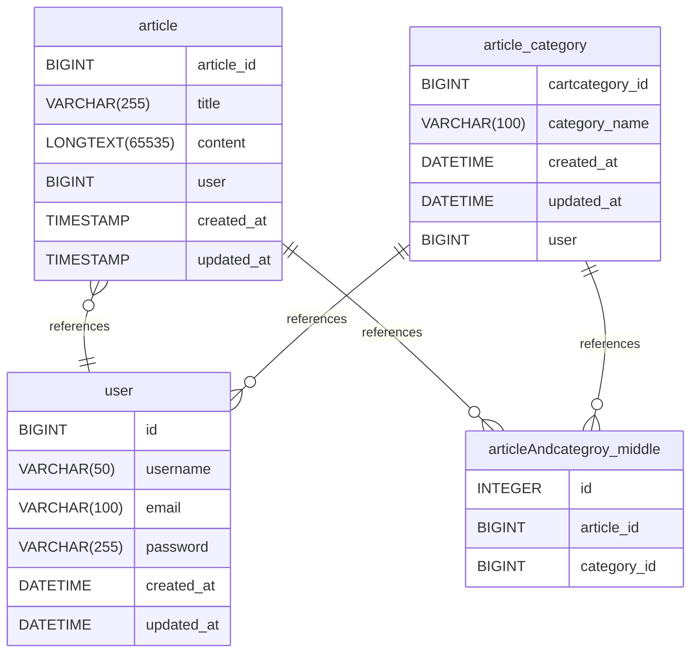

# Untitled Diagram documentation
## Summary

- [Introduction](#introduction)
- [Database Type](#database-type)
- [Table Structure](#table-structure)
	- [article](#article)
	- [article_category](#article_category)
	- [user](#user)
	- [articleAndcategroy_middle](#articleandcategroy_middle)
- [Relationships](#relationships)
- [Database Diagram](#database-diagram)

## Introduction

## Database type

- **Database system:** MySQL
## Table structure

### article
文章表
| Name           | Type            | Settings        | References                                      | Note   |
| -------------- | --------------- | --------------- | ----------------------------------------------- | ------ |
| **article_id** | BIGINT          | 🔑 PK, not null | fk_article_article_id_articleAndcategroy_middle | 文章ID   |
| **title**      | VARCHAR(255)    | not null        |                                                 | 文章标题   |
| **content**    | LONGTEXT(65535) | null            |                                                 | 文章内容   |
| **user**       | BIGINT          | not null        | fk_article_user_user                            | 创建用户ID |
| **created_at** | TIMESTAMP       | null            |                                                 | 创建时间   |
| **updated_at** | TIMESTAMP       | null            |                                                 | 更新时间   | 

### article_category
文章分类表
| Name                | Type         | Settings                         | References                                                    | Note   |
| ------------------- | ------------ | -------------------------------- | ------------------------------------------------------------- | ------ |
| **cartcategory_id** | BIGINT       | 🔑 PK, not null                  | fk_article_category_cartcategory_id_articleAndcategroy_middle | 文章分类ID |
| **category_name**   | VARCHAR(100) | not null                         |                                                               | 文章分类名称 |
| **created_at**      | DATETIME     | null, default: CURRENT_TIMESTAMP |                                                               | 创建时间   |
| **updated_at**      | DATETIME     | null, default: CURRENT_TIMESTAMP |                                                               | 更新时间   |
| **user**            | BIGINT       | null                             | fk_article_category_user_user                                 |        | 

### user
用户表
| Name           | Type         | Settings                           | References | Note     |
| -------------- | ------------ | ---------------------------------- | ---------- | -------- |
| **id**         | BIGINT       | 🔑 PK, not null                    |            | 用户ID     |
| **username**   | VARCHAR(50)  | not null, unique                   |            | 用户名      |
| **email**      | VARCHAR(100) | null, unique, default: liheng@test |            | 邮箱       |
| **password**   | VARCHAR(255) | not null                           |            | 密码(加密存储) |
| **created_at** | DATETIME     | null, default: CURRENT_TIMESTAMP   |            | 创建时间     |
| **updated_at** | DATETIME     | null, default: CURRENT_TIMESTAMP   |            | 更新时间     | 

### articleAndcategroy_middle
中间表
| Name            | Type    | Settings                       | References | Note |
| --------------- | ------- | ------------------------------ | ---------- | ---- |
| **id**          | INTEGER | 🔑 PK, not null, autoincrement |            |      |
| **article_id**  | BIGINT  | null                           |            | 文章id |
| **category_id** | BIGINT  | null                           |            | 分类id | 

## Relationships

- **article to user**: many_to_one
- **article_category to user**: one_to_many
- **article to articleAndcategroy_middle**: one_to_many
- **article_category to articleAndcategroy_middle**: one_to_many

## Database Diagram

